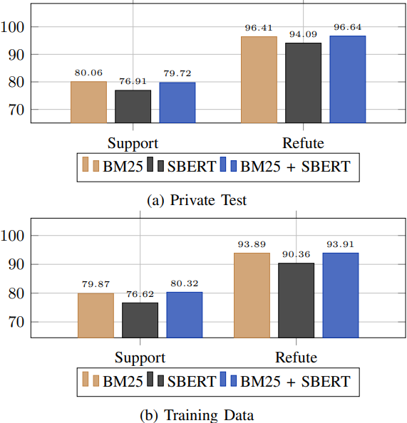

# ViNSV: Vietnamese Fact Extraction and Verification System (UIT - DSC 2023)

## Introduction
ViNSV is a system developed and designed to address the challenges of fact extraction and verification. This study presents the ViNSV system, which was developed as part of a competition [UIT-DSC 2023](https://dsc.uit.edu.vn/) using the ISE-DSC01 dataset. The system leverages advanced natural language processing techniques, including BM25, Sentence-BERT, and XLM-R, to achieve high accuracy in fact extraction and verification tasks.
## Results
During a private evaluation conducted on the ISE-DSC01 dataset, the ViNSV system demonstrated an impressive Strict Accuracy of 76.33%. This outstanding performance earned the system a [top 4 ranking](https://codalab.lisn.upsaclay.fr/competitions/15497#results), showcasing its remarkable competitiveness and effectiveness.

## ViNSV

    
         
    <em>Figure 1: Classification Pipeline.</em>

    
         
    <em>Figure 2: Evidence Retrieval Pipeline.</em>

In addition, we have also demonstrated that the ensemble model provides higher performance. The ensemble model's performance was rigorously evaluated against the standalone BM25 and SBERT models, utilizing Top-1 Accuracy (Acc@1) as the primary metric for Support (S) and Refute (R) evidence categories (Fig. 3).

    
         
    <em>Figure 3: The performance of algorithms for the task of Evidence
Retrieval, with the Acc@1 metric for Support and Refute.</em>

---

For any inquiries or issues regarding, please contact the following emails:
- Tran Quang Duy: 21522013@gm.uit.edu.vn
- Tran Thai Hoa: 21522082@gm.uit.edu.vn
